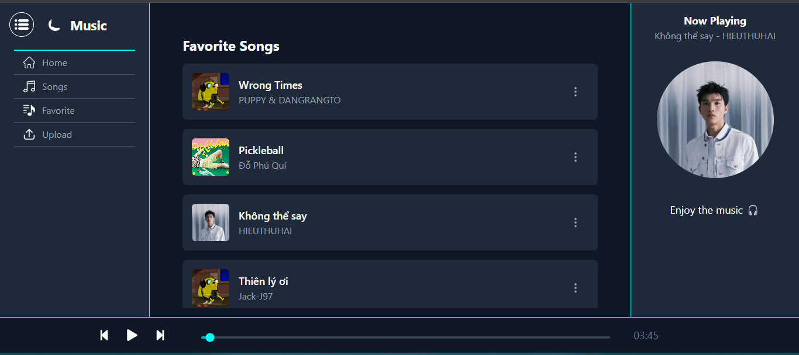
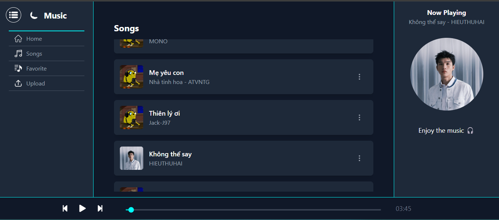

# Banana Music

## Giới thiệu

Ứng dụng nghe nhạc được xây dựng bằng Vite + React, kết nối với MySQL thông qua backend sử dụng Express.js và Node.js. Ứng dụng cung cấp các tính năng:

- **Home**: Hiển thị nội dung chính.
- **Songs**: Hiển thị danh sách bài hát từ cơ sở dữ liệu.
- **Favorites**: Hiển thị danh sách bài hát yêu thích.
- **Upload**: Cho phép người dùng tải nhạc lên.

### Giao diện ứng dụng

#### Trang chính (Home)


#### Danh sách bài hát (Songs)


#### Danh sách yêu thích (Favorites)



#### Tải nhạc lên (Upload)



---

## Công nghệ sử dụng

- **Frontend**: Vite, React
- **Backend**: Node.js, Express.js
- **Database**: MySQL

## Cài đặt và chạy ứng dụng

### Yêu cầu hệ thống

- Node.js
- MySQL

### Cách chạy ứng dụng

#### 1. Cài đặt backend

```sh
cd backend
npm install
npm start
```

#### 2. Cài đặt frontend

```sh
cd frontend
npm install
npm run dev
```

#### 3. Cấu hình MySQL

- Tạo database trong MySQL.
- Cập nhật thông tin kết nối trong file `.env` của backend:
  ```env
  DB_HOST=localhost
  DB_USER=root
  DB_PASSWORD=yourpassword
  DB_NAME=musicdb
  ```
